# SRGE

### Paper
SRGE: A Structured Rule Generation and Execution System Supporting Clinical Medical Calculation

### Demo Video
https://www.youtube.com/watch?v=8HImXgcdY1U

### Online Demo
http://101.132.148.193

## Usage Example
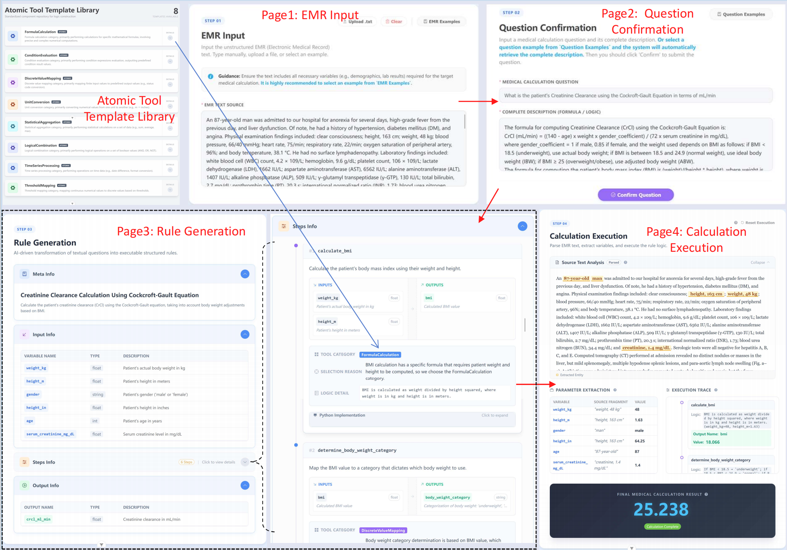

## Framework
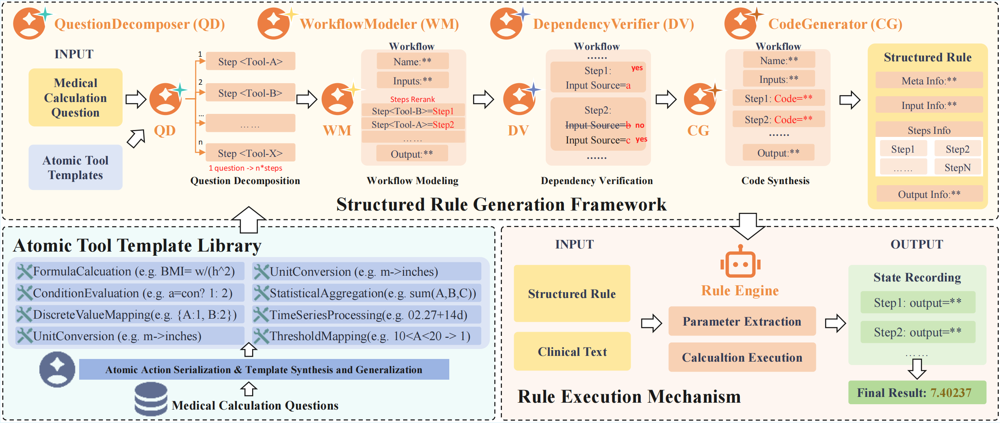

## Screenshots

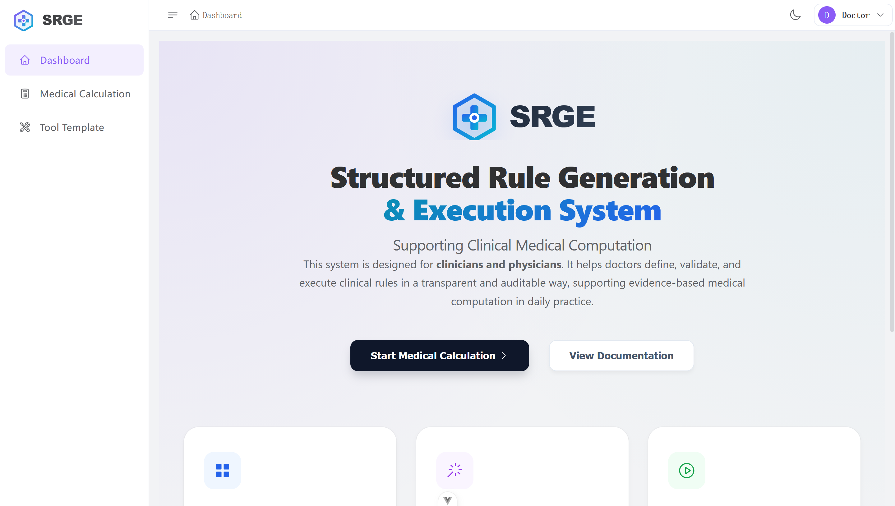
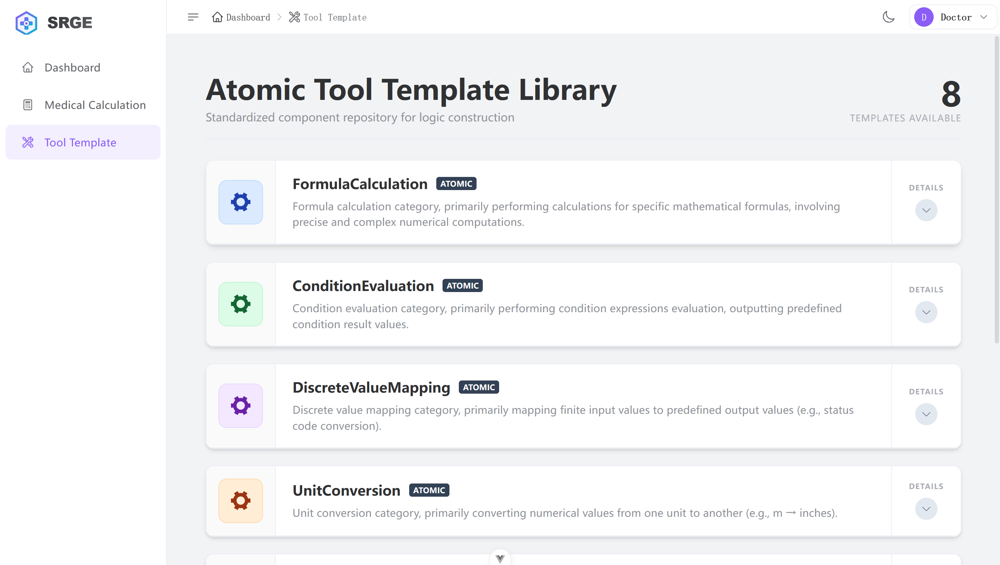
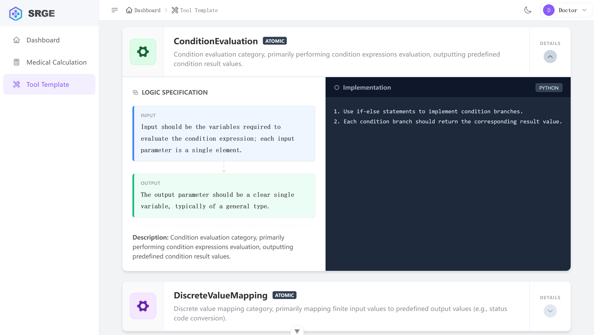
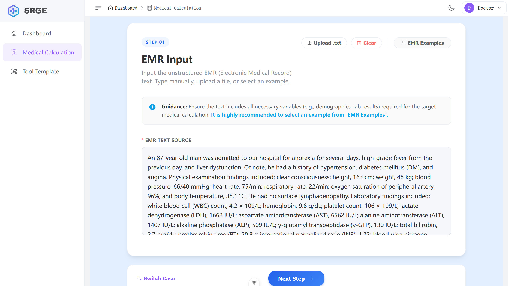
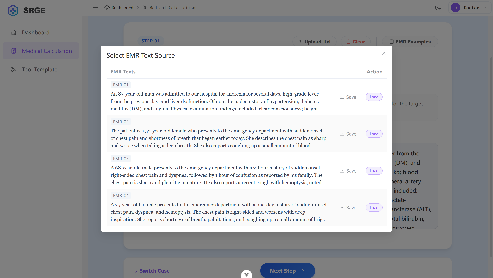
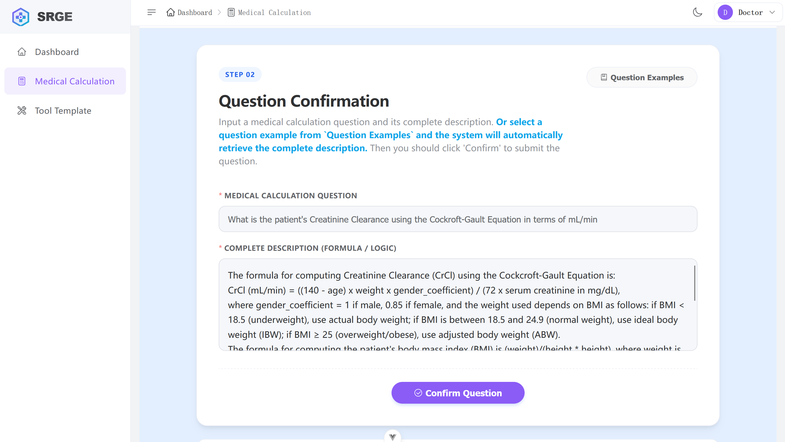
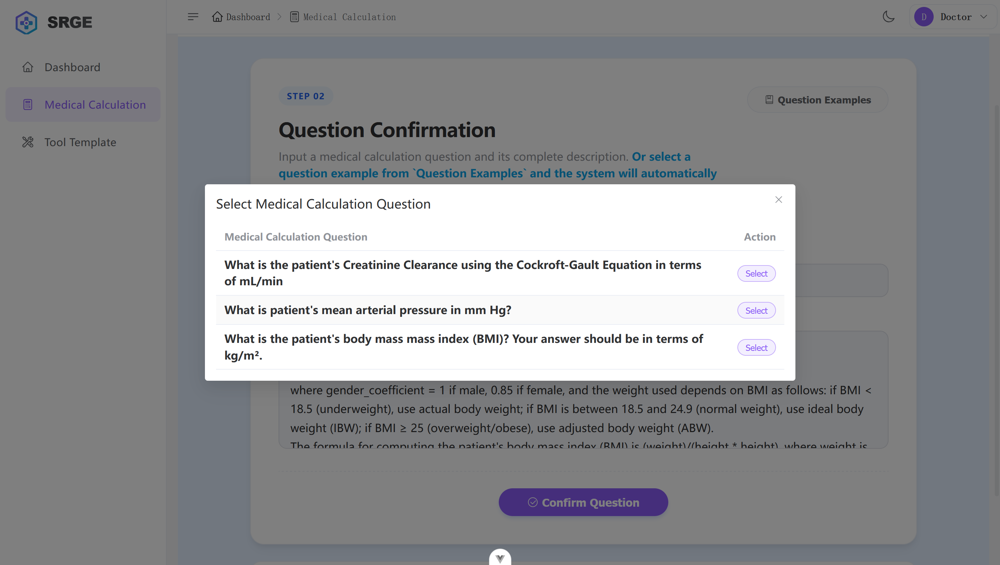
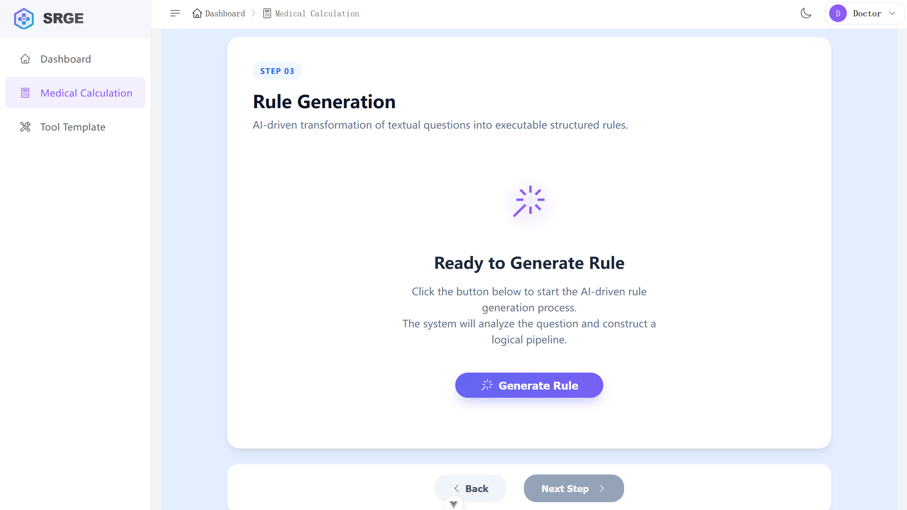
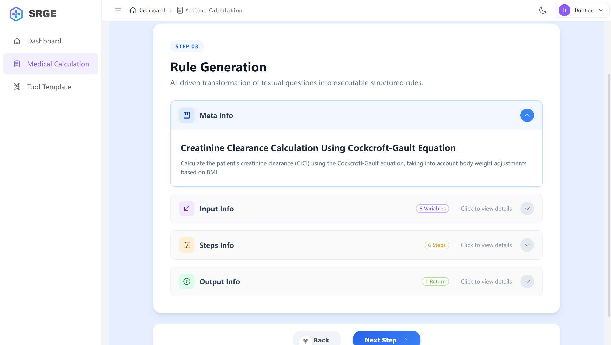
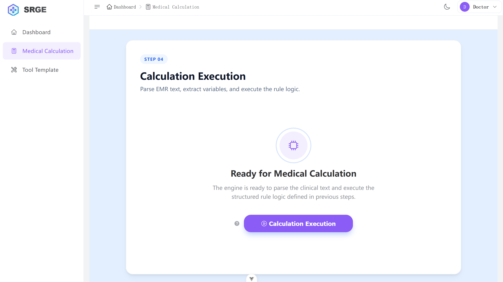
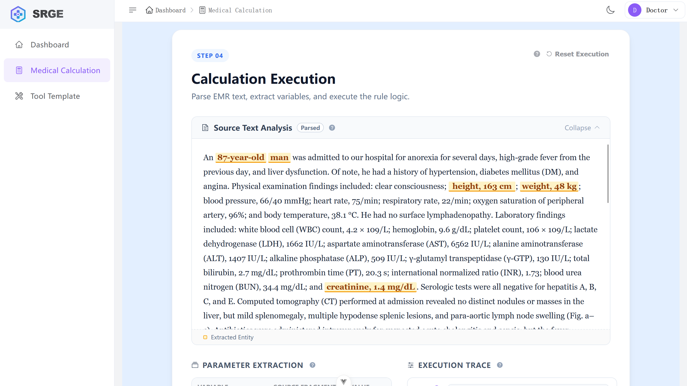
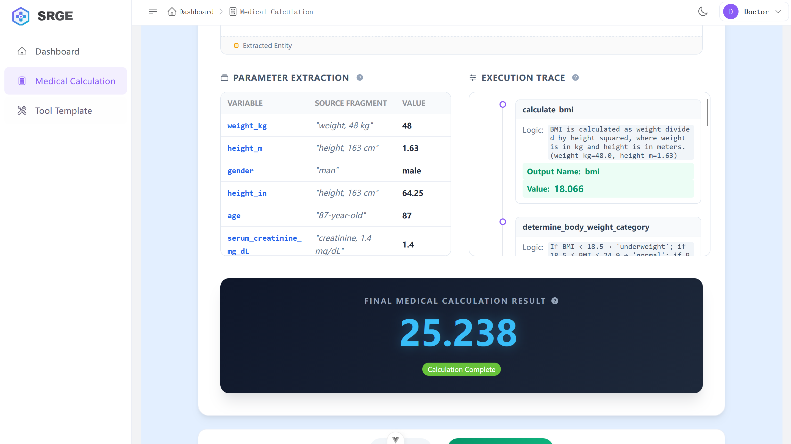

## Manual
See [Manual](https://ucngzub1w2nq.feishu.cn/docx/OIJtdD1CeoDOpzxfyCdcOhrWnXe?from=from_copylink) for details.
